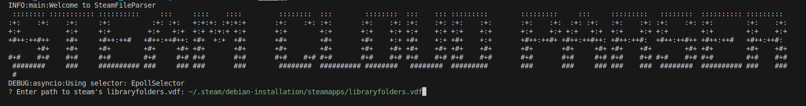
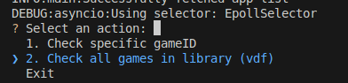
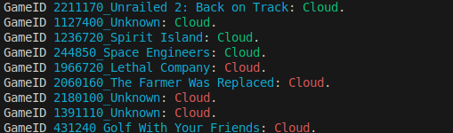

# Steam Cloud Check
Currently only checks installed games (for checking all games option) if they have CLOUD support. The intention is so you know what to backup.

## Requirements
- This project requires Python 3.11 or higher.
- UV package manager (you can manually install using pip from the pyproject.toml packages)

## Dependencies
This project depends on the following libraries:

- colorama >= 0.4.6
- inquirerpy >= 0.3.4
- pandas >= 2.2.3
- pyinstaller >= 6.12.0
- pytest >= 8.3.4
- requests >= 2.32.3

## Installation
To install the required dependencies, run the following command:

```
uv sync requirements.txt
```

## Usage
To use this project, simply run the main script:

```
uv run main.py
```
# Screenshots








## Contributing
Contributions are welcome! Please submit a pull request with your changes.

License
This project is licensed under [insert license here].